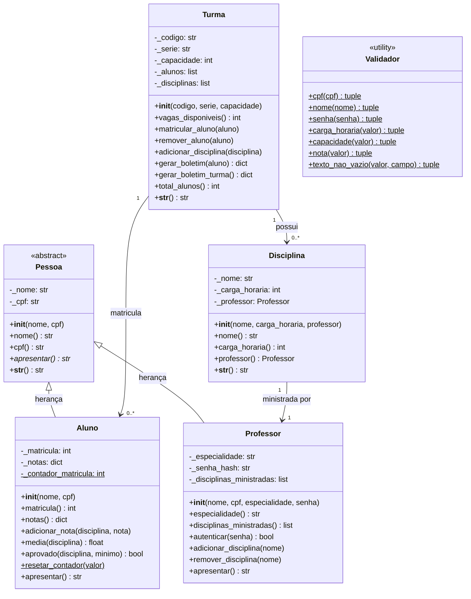

# Guia5 — Sistema de Escola (POO)

## Contexto

Este projeto implementa um **Sistema de Escola** completo utilizando o paradigma de **Orientação a Objetos** em Python. O sistema gerencia alunos, professores, disciplinas e turmas, aplicando os principais conceitos do curso de POO.

---

## 1. Diagrama UML

### Diagrama de Classes



---

## 2. Descrição das Classes

### `Pessoa` (abstrata)
Classe base abstrata (via `ABC`) para qualquer pessoa do sistema escolar. Define atributos comuns `_nome` e `_cpf` com encapsulamento via `@property`, e o método abstrato `apresentar()`, que funciona como um **contrato** obrigando subclasses a defini-lo.

**Conceitos aplicados:** Classe abstrata, ABC, encapsulamento, `@property`, `@abstractmethod`.

---

### `Aluno`
Herda de `Pessoa`. Representa um estudante matriculado. Gera automaticamente um número de **matrícula sequencial** usando um **atributo de classe** (`_contador_matricula`) e um **método de classe** (`resetar_contador`). Armazena notas por disciplina e calcula médias e situação de aprovação.

**Conceitos aplicados:** Herança, atributo de classe, método de classe (`@classmethod`), composição de dicionário, validação com `@property.setter`.

---

### `Professor`
Herda de `Pessoa`. Representa um docente. Além dos dados básicos e da lista de disciplinas ministradas, armazena um **hash SHA-256 da senha** para autenticação segura. O método `autenticar(senha)` permite verificar o acesso sem expor a senha em texto puro. O lançamento de notas no sistema exige autenticação prévia de um professor.

**Conceitos aplicados:** Herança, encapsulamento, `@property.setter` com validação, lista mutável encapsulada, hash de senha.

---

### `Disciplina`
Representa uma matéria escolar com nome, carga horária e professor responsável. Na criação, já notifica o professor via `adicionar_disciplina()`. Ao trocar de professor (via setter), remove o vínculo do anterior e cria o vínculo com o novo — demonstrando **composição bidirecional**.

**Conceitos aplicados:** Composição, `@property.setter` com efeito colateral, referência entre objetos.

---

### `Turma`
Agrega alunos e disciplinas. Controla a capacidade máxima de alunos e garante que não haja duplicatas. O método `gerar_boletim(aluno)` retorna o boletim completo de **um aluno específico**: para cada disciplina da turma, lista as notas lançadas, a média calculada e a situação (Aprovado/Reprovado/Sem notas). O método `gerar_boletim_turma()` retorna o boletim de **todos os alunos matriculados** de uma vez, reutilizando `gerar_boletim` internamente.

**Conceitos aplicados:** Composição (lista de `Aluno` e `Disciplina`), encapsulamento de listas (retorno de cópias), reuso de método dentro da própria classe.

---

### `Validador` *(novo)*
Classe utilitária com **métodos estáticos** que centralizam toda a lógica de validação de entradas do sistema. Cada método retorna uma tupla `(bool, resultado_ou_mensagem)`, onde `True` indica sucesso e `False` indica falha acompanhada de uma mensagem descritiva. O `main.py` usa esses métodos em loops que repetem a solicitação ao usuário até receber um valor válido.

| Método | O que valida |
|--------|-------------|
| `cpf(cpf)` | Exatamente 11 dígitos numéricos; aceita pontos e traços; rejeita sequências de dígitos iguais |
| `nome(nome)` | Apenas letras e espaços; obrigatório ter ao menos nome + sobrenome |
| `senha(senha)` | Mínimo de 4 caracteres |
| `carga_horaria(valor)` | Inteiro positivo entre 1 e 400 |
| `capacidade(valor)` | Inteiro positivo entre 1 e 100 |
| `nota(valor)` | Número entre 0 e 10; aceita vírgula como separador decimal |
| `texto_nao_vazio(valor, campo)` | Campo genérico não vazio |

**Conceitos aplicados:** Classe utilitária, métodos estáticos (`@staticmethod`), separação de responsabilidades, padrão de retorno consistente.

---

## 3. Estrutura do Projeto

```
sistema-escola/
├── src/                          ← classes de domínio
│   ├── __init__.py               ← exporta Pessoa, Aluno, Professor, Disciplina, Turma
│   ├── pessoa.py
│   ├── aluno.py
│   ├── professor.py
│   ├── disciplina.py
│   └── turma.py
├── utils/                        ← ferramentas de suporte
│   ├── __init__.py               ← exporta Validador + todas as funções de leitura
│   ├── validador.py              ← classe Validador (CPF, nome, nota…)
│   └── leitores.py               ← ler_*, escolher_da_lista, separador, autenticar_professor
├── tests/
│   ├── __init__.py
│   ├── test_aluno.py
│   ├── test_professor.py
│   ├── test_disciplina.py
│   ├── test_turma.py
│   ├── test_sistema_escola.py
│   └── test_validador.py
├── main.py
├── requirements.txt
├── .gitignore
└── Guia5_SistemaEscola_README.md
```

### Separação de responsabilidades

| Pasta | O que contém | Critério |
|-------|-------------|----------|
| `src/` | Classes de domínio (`Aluno`, `Professor`, `Turma`…) | Representam as entidades do problema |
| `utils/` | `Validador` + funções `ler_*` / `escolher_da_lista` | Ferramentas de suporte sem lógica de negócio |
| `tests/` | Suíte completa de testes pytest | Um arquivo por classe testada |

---

## 4. Preparando o Ambiente

### 4.1 Criar o ambiente virtual

Na pasta do projeto `...\sistema-escola>`, execute:

```bash
python -m venv .venv
```

### 4.2 Ativar o ambiente virtual

#### Windows

```bash
.\.venv\Scripts\activate
```

#### Linux / macOS

```bash
source .venv/bin/activate
```

### 4.3 Instalar dependências

```bash
pip install -r requirements.txt
```

### 4.4 Executar os testes

```bash
pytest -v
```

ou

```bash
python -m pytest -v
```

Para ver a **cobertura de testes**:

```bash
pytest -v --cov=src --cov-report=term-missing
```

### 4.5 Executar o sistema

```bash
python main.py
```

---

## 5. Funcionalidades do Sistema (main.py)

Ao rodar `python main.py`, o terminal exibe um menu interativo com as seguintes opções:

| Opção | Funcionalidade |
|-------|----------------|
| `[1]` | **Cadastrar Professor** — informa nome completo, CPF, especialidade e **senha** (mín. 4 caracteres) |
| `[2]` | **Cadastrar Disciplina** — escolhe o professor em uma lista e define carga horária |
| `[3]` | **Criar Turma** — define código (ex: `9A`), série e capacidade máxima; permite vincular disciplinas escolhendo-as em lista |
| `[4]` | **Matricular Aluno** — escolhe a turma em lista, depois cadastra o aluno (nome completo + CPF) |
| `[5]` | **Lançar Nota** *(requer acesso de professor)* — o professor se autentica com sua senha; só pode lançar notas nas disciplinas que ministra |
| `[6]` | **Boletim de um Aluno** — escolhe **turma** → escolhe **aluno da turma**; exibe notas, média e situação por disciplina |
| `[7]` | **Boletim da Turma Inteira** — escolhe a turma em lista; exibe o boletim de todos os alunos matriculados |
| `[8]` | **Listar Turmas** — exibe todas as turmas com suas disciplinas e alunos |
| `[0]` | **Sair** |

> **Nenhuma opção do menu exige buscar algo digitando um nome ou código.** Toda seleção (professor, disciplina, turma, aluno) é feita por **lista numerada**.

> **Validação em loop:** todos os campos de entrada passam pela classe `Validador`. Caso o valor seja inválido, o sistema exibe uma mensagem de erro clara e solicita nova digitação até receber um valor correto.

> **Padronização de texto:** todo campo de texto (exceto senha) passa por `.strip().upper()` antes de ser processado.

---

## 5.1 Fluxo de Autenticação para Lançar Nota

```
[5] Lançar Nota
  └─ Lista de professores cadastrados
       └─ Escolhe o professor
            └─ Digita a senha
                 ├─ Senha correta → escolhe aluno → escolhe disciplina (só as do professor) → digita nota
                 └─ Senha errada  → "Acesso negado." → volta ao menu
```

O professor só visualiza e pode lançar notas nas disciplinas que ele próprio ministra.

---

## 5.2 Fluxo do Boletim de um Aluno

```
[6] Boletim de um Aluno
  └─ Lista todas as turmas cadastradas
       └─ Escolhe a turma
            └─ Lista os alunos da turma selecionada
                 └─ Escolhe o aluno → exibe boletim
```

A etapa intermediária de seleção de turma garante que o usuário veja apenas os alunos da turma de interesse.

---

## 6. Exemplo de uso típico

1. Cadastre um professor: `Rodrigo Alves | Matemática | senha: mat123`
2. Crie a disciplina `Matemática (80h)` vinculada a ele
3. Crie a turma `9A | 9º Ano | capacidade: 30`
4. Matricule alunos na turma
5. Lance notas: autentique-se como professor → escolha aluno → escolha disciplina → informe nota
6. Consulte o boletim: escolha a turma → escolha o aluno → veja o resultado

---

## 7. Conceitos de POO Aplicados

| Conceito | Onde aparece |
|----------|-------------|
| **Classes e objetos** | Todas as classes |
| **Encapsulamento** | `_atributos` com `@property` e validação nos setters |
| **Herança** | `Aluno` e `Professor` herdam de `Pessoa` |
| **Polimorfismo** | `apresentar()` redefinido em cada subclasse; `__str__` delega a `apresentar()` |
| **Classe abstrata / ABC** | `Pessoa` com `@abstractmethod apresentar()` |
| **Atributo de classe** | `Aluno._contador_matricula` |
| **Método de classe** | `Aluno.resetar_contador()` com `@classmethod` |
| **Método estático** | `Validador.*` com `@staticmethod` |
| **Classe utilitária** | `Validador` em `utils/` — centraliza toda a lógica de validação |
| **Separação de camadas** | `src/` (domínio) vs `utils/` (suporte) — cada pasta com responsabilidade única |
| **Composição** | `Turma` contém listas de `Aluno` e `Disciplina`; `Disciplina` referencia `Professor` |
| **Autenticação com hash** | `Professor._senha_hash` usando SHA-256 |
| **Validação e exceções** | `ValueError`, `OverflowError` em cenários de negócio; `Validador` em entradas do usuário |
